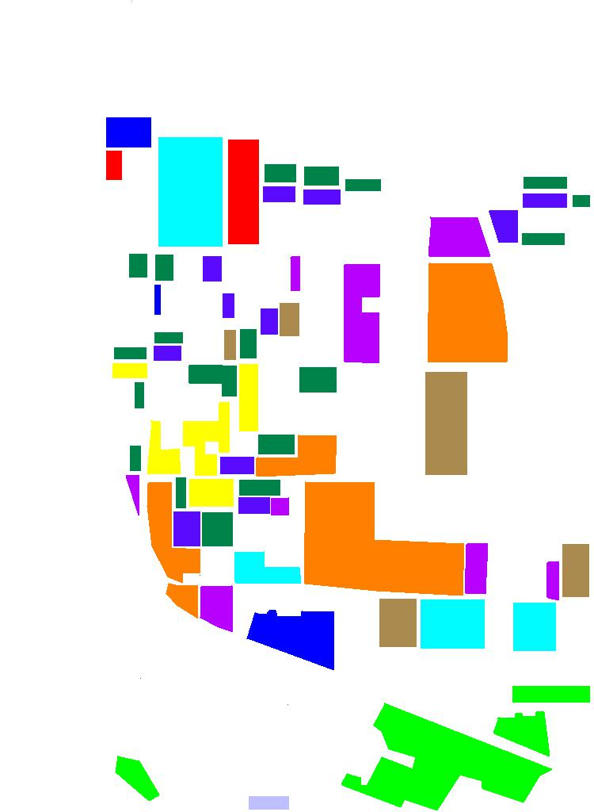
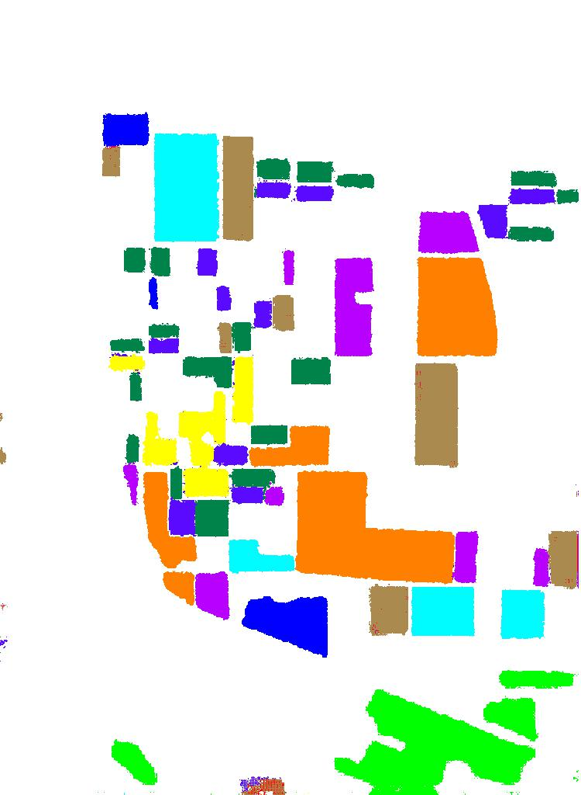

# Sar_Image_Classfication

dataMake.py 用于组织 Flevoland 和San Francisco Bay Sar数据 为numpy格式
input/dataset 目录下存放为Sar 图像的数据和标签 数据包括 3个复数数据和3和实数数据

sarclassfication可测试.ipynb为notebook格式的所有程序

train.py用于测试和训练

下图为 frevoland的分割label

下图为 frevoland的分割预测数据 准确率可达0.95
